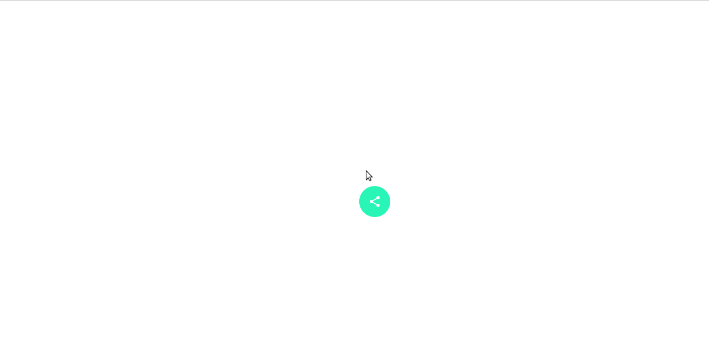

# CSS-Tricks

Snippets of some simple yet powerful designes.

## Hamburger

Switching icon for a nav drawer.

## Landing Page from SVG

Scrollable svg html page which narrates how an alien from a spaceship descended to earth.

## Share Icon

Android share icon.

## Music List

Static page for an artist songs display, built responsively using Flexbox.

## Square to Circle

Simple animation which transitions a square to circle, and back forth.

## Striped Photos

Interactive layout with expanding photos on hover, also responsive via Flexbox.

## Visiting Card

The easiest way to display your credentials is via a Visiting Card, and I don't have one as yet. So decided to build upon it.

---

More such designs to come soon.
